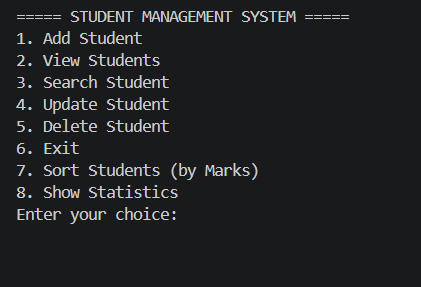
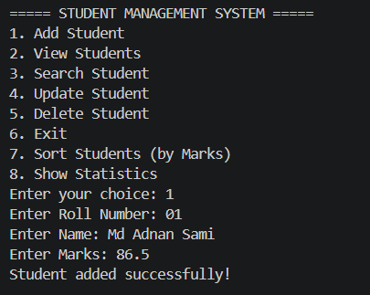
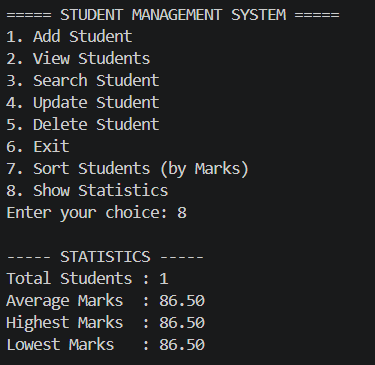

# Student Management System (C)

A console-based Student Management System built in C, following professional software engineering practices — structured, modular, and file-persistent.

## Features
- Add, View, Search (by Roll Number or Name), Update, Delete student records
- Grade calculation (A/B/C/D/F) based on marks
- Sort students by Marks, Name, or Roll Number
- View statistics (total, average, highest, lowest marks)
- Persistent data storage using file handling (with automatic backup)
- Export data to CSV (Excel-compatible)
- Simple login authentication
- Input validation and error handling (type checks, range checks, empty checks)

## Folder Structure

\`\`\`
Student-Management-System/
├── include/
│   └── student.h        # Struct definition and function declarations
├── src/
│   ├── main.c            # Program entry point and menu logic
│   ├── student_ops.c     # Add, View, Search, Update, Delete
│   ├── file_ops.c        # Save, Load, Export to CSV
│   ├── utils.c           # Sorting, Statistics, Validation, Login
│   └── Makefile           # Build automation
├── data/
│   ├── students.txt       # Main data storage
│   ├── backup.txt         # Backup copy
│   └── students.csv       # CSV export
├── screenshots/
├── README.md
└── LICENSE
\`\`\`

## Concepts Used
- Structures and arrays of structures
- Pointers and pass-by-reference
- File handling (fopen, fprintf, fscanf, fgets)
- Bubble sort algorithm (multiple sort keys)
- Modular programming (multi-file C project)
- Input validation and buffer handling
- Basic authentication logic

## Screenshots





## How to Compile
```bash
cd src
gcc main.c student_ops.c file_ops.c utils.c -o app
```
Or, if `make` is available (Linux/Mac):
```bash
cd src
make
```

## How to Run
```bash
./app
```
Login credentials: `admin` / `admin123`

## Future Improvements
- Secure password hashing
- Colored terminal UI
- Search/filter by marks range

## Learning Outcomes
Built this project to strengthen C fundamentals — structures, file handling, pointers, and modular programming — before transitioning to C++.

## Author
Md Adnan Sami